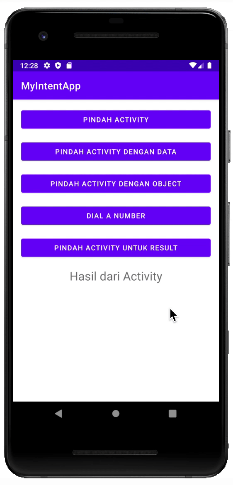
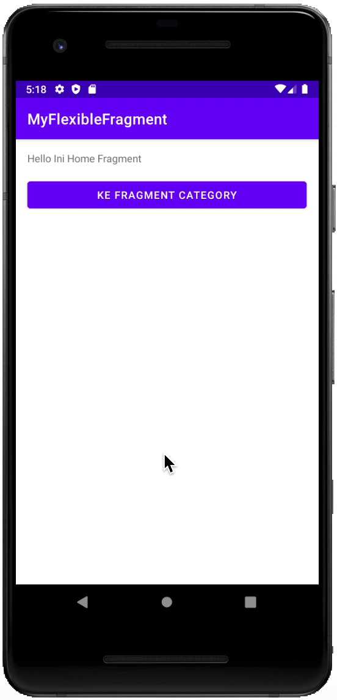

# Belajar Intent dan Fragment

## Intent
Intent merupakan mekanisme untuk melakukan sebuah action dan komunikasi antar komponen aplikasi. Contoh, kamu memiliki sebuah halaman Activity yang terdapat tombol di dalamnya. Lalu kamu tekan tombol tersebut untuk membuka peta, kamera, atau halaman lainnya. Nah, perpindahan inilah yang dinamakan Intent. Gimana sudah mulai terbayang konsep dasar Intent? Jika mulai paham, mari kita lanjut.

Intent terbagi menjadi 2 bagian yaitu Intent Implicit dan Intent Explicit.

Intent Implicit: Berfungsi melakukan perpindahan activity (halaman) menuju ke aplikasi internal smartphone kamu. Contohnya ketika kamu hendak membuka sebuah kamera.
Intent Explicit: Berfungsi melakukan perpindahan activity (halaman) ke activity (halaman) lainnya. Explicit intent bekerja dengan menggunakan nama kelas yang dituju, misal com.dicoding.activity.DetailActivity. Umumnya intent ini digunakan untuk mengaktifkan komponen pada satu aplikasi.
Sumber: [baca disini](https://www.dicoding.com/blog/belajar-intent-android-studio)

### Screen Shoot App

## Fragment
Fragment adalah sebuah reuseable class yang mengimplement beberapa fitur sebuah Activity. Fragment biasanya dibuat sebagai bagian dari suatu antarmuka. Sebuah fragment harus berada di dalam sebuah activity, mereka tidak dapat berjalan sendiri tanpa adanya activity tempat mereka menempel.

Sebuah Fragment merupakan kombinasi sebuah layout XML dan kelas java yang mirip dengan sebuah Activity.
Dengan menggunakan support library, fragment dapat mendukung hampir semua versi Android.
Fragment dapat dipakai berulang kali didalam activity.
Fragment merupakan komponen utuh yang memiliki view, event, dan logic (meskipun tetap membutuhkan sebuah fragment agar dapat bekerja).
Dalam arsitektur berorientasi fragment, activity menjadi navigational container yang bertugas untuk melakukan navigasi ke activity lain, menampilkan fragment dan mengirim data.
Sumber: [baca disini](https://www.codepolitan.com/membuat-dan-menggunakan-fragment-59f80eff061a4)

### Screen Shoot App

## Thanks to
- [x] [Sense Martin](https://github.com/martinputra) 🤗
